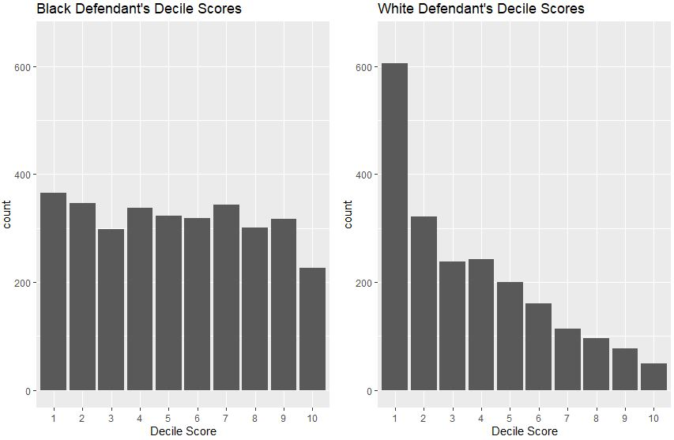

# Recidivism Prediction

### Info
- **Module:** Statistical Thinking for Data Science and Analytics
- **Tools Used:**
  - RStudio
    - R Packages (dplyr, ggplot2, grid, gridExtra, survival, ggfortify)
  - Microsoft Excel
- **Assets:**
  - [_compas-scores-two-years_](./source/compas-scores-two-years.csv) (Excel csv file with 2 years of ***COMPAS*** data)
  - [_cox-parsed_](./source/cox-parsed.csv) (Excel csv file with 3.5+ years of ***COMPAS*** data for ***recidivism***)
  - [_cox-violent-parsed_](./source/cox-violent-parsed.csv) (Excel csv file with 3.5+ years of ***COMPAS*** data for violent ***recidivism***) 
  - [_STD-1222A-NGJUNCHENGBENNY-PROJECT_](./source/STD-1222A-NGJUNCHENGBENNY-PROJECT.Rmd) (R code file)
  - [_images_](./images) folder (Misc. image files)

---
### Description
---
In this project, analysis is performed on several datasets from the ***COMPAS*** system to discover the possible bias in the system and to assess its accuracy in deciding whether a defendant has a low, medium, or high risk of ***recidivism***. 

The ***IRAC*** method is utilized during the data analysis to come up with the conclusion on whether the white or black defendants are at higher risk of ***recidivism*** and violent ***recidivism***.

---
### Background
---
***COMPAS*** (***C***_orrectional_ ***O***_ffender_ ***M***_anagement_ ***P***_rofiling for_ ***A***_lternative_ ***S***_anctions_) is a tool used in the US criminal justice system for risk-assessment and decision-making related to sentencing, parole, and probation. It uses a predictive algorithm that analyses factors such as age, gender, race, criminal history of the convicted to assess and give a score rating related to their risk of ***recidivism*** (re-offending).

***IRAC*** is a structured approach for legal analysis and used in legal writing to organize and present arguments. It stands for ***I***_ssue,_ ***R***_ule,_ ***A***_pplication,_ ***C***_onclusion_: 


**Issue:**  
The issue is the legal issue or the question that presents a legal ambiguity that needs to be solved. The issue should be specific and not too general. 

**Rule:**  
The rule describes the law or legal principle that applies to the issue which can be used as the legal framework for the analysis of the issue. 

**Application:**  
The application is applying the rule/(s) to the scenario's facts to formulate arguments as to whether the rule is applicable to the issue or not. This makes up the analysis required to arrive at the conclusion. 

**Conclusion:**  
The conclusion is the result of the analysis after the application of the rule/(s) to the facts. It should help to address the issue presented.

Federal laws of the United States of America prohibit discrimination based on a person's national origin, race, color, religion, disability, sex, and familial status. Hence, by performing the tasks in the project, bias/(es) in the ***COMPAS*** system used in the US can be identified and the ***IRAC*** method can be used to produce the conclusion as to whether the white or black defendants are at a higher risk of ***recidivism*** and risk of violent ***recidivism***.

---

### Sample Work
---
**Project Workflow**  


The general workflow used is as per shown above.</br></br>
In the first part of the project, logistic regression model is used to predict the risk assigned (low or high) based on categorical features such as race, gender, and age category and allows to calculate the chance of a group of defendants receiving a higher score rating (higher risk) over another group of defendants.</br></br>
In the second part of the project, Cox PH (Cox Proportional Hazard) model is used to test the accuracy of the ***COMPAS*** system in deciding whether a defendant has a low, medium, or high risk of ***recidivism***. Cox PH is a statistical model for analysing survival or time-to-event data. With it, the factors that may influence the risk of recidivism can be examined and the probability of defendants to re-offend over a particular period after they are released can be estimated.
##
**R Code and Details (some snippets)**  

- **Plotting the distribution of decile score (score of 1 to 10) with respect to race (black or white defendants) where decile score can be interpreted as follows:**</br></br>
  - 1 – 4: Risk of ***recidivism*** is low relative to other offenders
  - 5 – 7: Risk of ***recidivism*** is medium relative to other offenders
  - 8 – 10: Risk of ***recidivism*** is high relative to other offenders 

```r
# Task 2: Read and prepare the data for Risk of Recidivism
# Q6: Plot the data with race and decile score
pblack <- ggplot(data=filter(df, race == "African-American"), aes(ordered(decile_score))) +
  geom_bar() +
  xlab("Decile Score") +
  ylim(0, 650) +
  ggtitle("Black Defendant's Decile Scores")
  
pwhite <- ggplot(data=filter(df, race == "Caucasian"), aes(ordered(decile_score))) +
  geom_bar() +
  xlab("Decile Score") +
  ylim(0, 650) +
  ggtitle("White Defendant's Decile Scores")
  
grid.arrange(pblack, pwhite, ncol = 2)
```



The distribution of counts of decile scores for black defendants is mostly similar in the full score range, with numbers from around 200+ to slightly less than 400. Whereas for white defendants, there is a clear downward trend in their deciles scores as the score increases. In general, more white defendants received a lower decile score than black defendants and there is clearly bias in the ***COMPAS*** system.
##
- **Running a logistic regression model to compare low scores to high scores**

```r
# Build logistic regression model
lrmodel <- glm(score_factor ~ gender_factor + age_factor + race_factor + priors_count + crime_factor + two_year_recid, family="binomial", data=df) 

# Check the summary and structure of model
summary(lrmodel) 
str(lrmodel)

### Optional 
control <- exp(-1.52554) / (1 + exp(-1.52554)) 
control 

# Black defendants are 45% more likely than white defendants to receive a higher score correcting for
# the seriousness of their crime, previous arrests, and future criminal behavior
exp(0.47721) / (1 - control + (control * exp(0.47721)))
```

**Logistic Regression model summary**


**Calculation of chance of black defendants to get a higher score than white defendants**


From the logistic regression model coefficients, calculation is performed to show that black defendants are 45% more likely than white defendants to receive a higher score from the ***COMPAS*** system.
##
- **Plotting the distribution of decile score  with respect to race (black or white defendants) for violent crimes</br>Note:** R code is not included here since it is similar to that for non-violent dataset shown previously


For violent crimes, there is a downward trend for both black and white defendants' decile scores as those scores increase. However, the decrease for black defendants' deciles scores is more gradual whereas the decrease is steep for that of white defendants. Similar to non-violent crimes, higher numbers of white defendants received a lower decile score than black defendants by the ***COMPAS*** system, indicating bias.
##
- **Survival Analysis (Recidivism: Black vs White Defendants)**

```r
# Task 5: Predict Accuracy (Non Violent Recidivism with respect to Race)
# Q4: Get summary of fit, white fit and black fit
# Using the survival function
f <- Surv(start, end, event, type="counting") ~ score_factor 

summary(f)

plotty <- function(fit, title) { 
 return(autoplot(fit, conf.int=T, censor=F) + ggtitle(title) + ylim(0,1))
}

overall_fit <- survfit(f, data=grp)
summary(overall_fit, times=c(730))

white <- filter(grp, race == "Caucasian") 
white_fit <- survfit(f, data=white)
summary(white_fit, times=c(730))

black <- filter(grp, race == "African-American") 
black_fit <- survfit(f, data=black)
summary(black_fit, times=c(730))

# Task 5: Predict Accuracy (Non Violent Recidivism with respect to Race)
# Q5: Get summary of coxph for white and black data

### Optional - overall
plotty(overall_fit, "Overall - Non Violent")

grid.arrange(plotty(white_fit, "White defendants (Non Violent)"), plotty(black_fit, "Black defendants (Non Violent)"), ncol=2)
```


Compared with the overall ***recidivism*** rate, white defendants have a lower ***recidivism*** rate (higher survival probability from the plots) than black defendants for each category of risk score (low, medium, high) assigned by the ***COMPAS*** system. This means that black defendants are likely to get a higher score rating than white defendants by the ***COMPAS*** system. 

Also, the 95% confidence interval range for the survival probabilities, especially for medium and high risk scores for white defendants is much wider than that for the black defendants. This means the ***COMPAS*** system is more precise when assigning risk score rating for black defendants than white defendants and hence less accurate for white defendants.
##
- **Survival Analysis (Violent Recidivism: Female vs Male Defendants)</br>Note:** R code is not included here since it is similar to that shown previously


Female defendants have a lower violent ***recidivism*** rate (higher survival probability from the plots) than male defendants for high risk score assigned by the ***COMPAS*** system. This indicates a possible bias in the system that male defendants are more likely to get a high risk score than female defendants.

Also, the 95% confidence interval range for the survival probabilities for high risk scores for female defendants is much wider than that for the male defendants. It is so wide that the 95% confidence interval range for medium risk scores for female defendants is contained within it, indicating that the ***COMPAS*** system is especially not accurate when assigning a high risk score for violent ***recidivism*** for female defendants.

---
### Conclusion
---
A program in R is written using RStudio in which a combination of exploratory data analysis and creation of logistic regression models and Cox PH models is used to analyse data from the ***COMPAS*** system. The evidences show that there are several biases in the system.